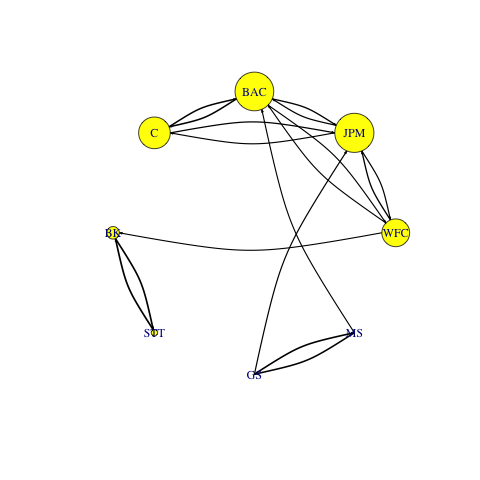

[](http://quantlet.de/)

## [](http://quantlet.de/) **METISNET-NNQR-centrality** [](http://quantlet.de/)

```yaml

Name of QuantLet : METISNET-NNQR-centrality

Published in : METIS

Description : 'Plots the average risk spillover effects after thresholding, by only considering the 30% largest connections of the network, with various centrality scores attached to each bank'

Keywords : quantile regression, neural networks, systemic risk, centrality measures, spillover effect

See also : 'NNQR_CoVaR, NNQR_Heat, NNQR_SNRI, MNQR_Network'

Authors : Georg Keilbar and Ya Qian

Submitted : April 10 2019 by Ya Qian

```





### R Code
```r


# clear all variables
rm(list = ls(all = TRUE))
graphics.off()
#setwd("")


# install and load packages
libraries = c("igraph")
lapply(libraries, function(x) if (!(x %in% installed.packages())) {
  install.packages(x)
})
lapply(libraries, library, quietly = TRUE, character.only = TRUE)


# read data
data  = read.csv(file = "data.csv")
date  = as.Date(data[, 1])
spill_All = as.matrix(read.csv(file = "Spillover_All.csv"))
spill_Leh = as.matrix(read.csv(file = "Spillover_Lehman.csv"))


# set the parameters
names = colnames(data)[-1]
network = graph_from_adjacency_matrix(spill_All, weighted = T, diag = F)
E(network)$width = ((E(network)$weight)) * 5
E(network)$color = "black"
V(network)$name  = names
V(network)$color = "yellow"
V(network)$label.cex = 1

threshold = delete.edges(network, which(E(network)$weight < quantile(E(network)$weight, 0.7)))

par(mar = c(0, 0, 0, 0))
png('banking_network_without_centrality.png')
plot.igraph(threshold, vertex.size = 30, edge.arrow.size = 0.2, 
            edge.curved = 0.2, layout = layout.circle(network))
dev.off()

# centrality scores
# degree centrality
dc1 = degree(threshold, mode = 'in')
dc2 = degree(threshold, mode = 'out')
dc3 = degree(threshold, mode = 'total')
png('banking_network_in_degree_centrality.png')
plot.igraph(threshold, vertex.size = dc1*8, edge.arrow.size = 0.2, 
            edge.curved = 0.2, layout = layout.circle(network))

dev.off()

png('banking_network_out_degree_centrality.png')
plot.igraph(threshold, vertex.size = dc2*8, edge.arrow.size = 0.2, 
            edge.curved = 0.2, layout = layout.circle(network))

dev.off()

png('banking_network_total_degree_centrality.png')
plot.igraph(threshold, vertex.size = dc3*8, edge.arrow.size = 0.2, 
            edge.curved = 0.2, layout = layout.circle(network))

dev.off()

# closeness centrality
cc1 = closeness(threshold, mode = 'in', weights = E(threshold)$weight)
cc2 = closeness(threshold, mode = 'out', weights = E(threshold)$weight)
cc3 = closeness(threshold, mode = 'total', weights = E(threshold)$weight)
png('banking_network_in_closeness_centrality.png')
plot.igraph(threshold, vertex.size = cc1*100, edge.arrow.size = 0.2, 
            edge.curved = 0.2, layout = layout.circle(network))

dev.off()

png('banking_network_out_closeness_centrality.png')
plot.igraph(threshold, vertex.size = cc2*100, edge.arrow.size = 0.2, 
            edge.curved = 0.2, layout = layout.circle(network))

dev.off()

png('banking_network_total_closeness_centrality.png')
plot.igraph(threshold, vertex.size = cc3*100, edge.arrow.size = 0.2, 
            edge.curved = 0.2, layout = layout.circle(network))

dev.off()

# betweenness centrality
bc = betweenness(threshold, directed = TRUE, weights = E(threshold)$weight)

png('banking_network_betweenness_centrality.png')
plot.igraph(threshold, vertex.size = bc*3, edge.arrow.size = 0.2, 
            edge.curved = 0.2, layout = layout.circle(network))

dev.off()

# eigenvector centrality
ec = eigen_centrality(threshold, directed = TRUE, weights = E(threshold)$weight, scale = FALSE)
ec1=ec$vector
png('banking_network_eigenvector_centrality.png')
plot.igraph(threshold, vertex.size = ec1*50, edge.arrow.size = 0.2, 
            edge.curved = 0.2, layout = layout.circle(network))

dev.off()


```

automatically created on 2019-04-10